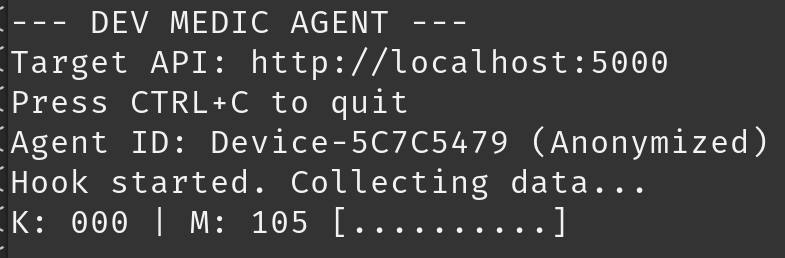
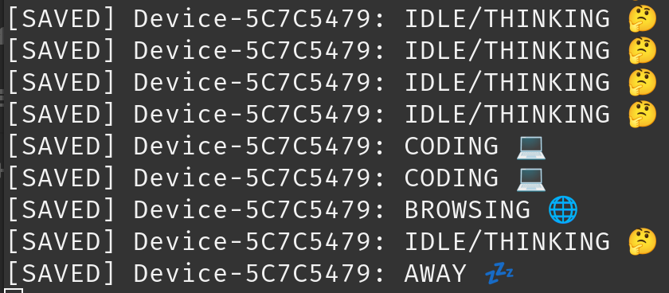

# DevMedic 🩺

**DevMedic** is a distributed "Heart Monitor" for developers. It tracks your cognitive state (Coding, Browsing, Idle) based on your input patterns (Keystrokes vs. Mouse usage) and logs it to a persistent database.

It is built as a **Privacy-First "Black Hole"** application. Data enters the system, but the system is architecturally incapable of leaking it to the internet.

---

## 🏗 Architecture

The system uses a **Split Architecture** to balance access with isolation:

* **DevMedic.Agent (Host OS):** A C# Console Application running natively on Linux. It uses `SharpHook` to listen to global low-level input events. It anonymizes your identity and aggregates activity into 1-second "Pulses" before firing them to the API.
* **DevMedic.Api (Docker):** A .NET 9 Web API running in a locked-down container. It receives pulses, classifies activity, and saves history to a local SQLite database.

---

## 🤔 Philosophy ("The Why")

Most trackers run in the cloud and sell your data. I wanted to see if I could build a system that was mathematically incapable of leaking data. This project proves you can build 'Black Hole' software that is useful, distributed, and completely private.

---

## 🛡️ Privacy ("The Vault")

DevMedic is designed to be a digital black hole. We employ four layers of privacy hardening:

1.  **Network Isolation:** The API container is bound strictly to `127.0.0.1`. It is invisible to your local network (LAN) and the internet. It cannot receive connections from outside, and it cannot initiate connections to the outside.
2.  **Source Anonymization:** The Agent does **not** send your hostname or username. It generates a cryptographic hash (SHA256) of your machine name (e.g., `Device-4A7F92B1`).
3.  **Telemetry Kill-Switch:** The .NET Runtime telemetry and Microsoft "phone home" features are explicitly disabled via environment variables (`DOTNET_CLI_TELEMETRY_OPTOUT`).
4.  **Data Scrubbing:** The application counts *events* (e.g., "Key Pressed"). It **never** records *which* key was pressed. Your passwords and code content never leave the input buffer.

---

## 📸 See It In Action

<p align="center">
  
  
</p>

### Left: The Agent (Sensor)
*Running natively on Linux, capturing high-frequency input patterns.*

### Right: The API (Brain)
*Running inside a locked-down Docker container, processing signals without internet access.*

---

## 🚀 Prerequisites

* **.NET 9 SDK** (For running the Agent)
* **Docker & Docker Compose** (For running the API)
* **Linux Environment** (Agent currently optimized for Linux/X11/Wayland via SharpHook)

---

## 🛠️ Setup & Run

### 1. Start the API (The Brain)
We use `docker compose` to enforce network isolation and environment variables.

```bash
# From the solution root
docker compose up -d
```

* *The API is now running in the background, listening only on http://127.0.0.1:5000*
* *To view logs:* `docker logs -f devmedic-api`
* *To stop:* `docker compose down`

### 2. Start the Agent (The Sensor)
Open a new terminal. The Agent must run natively to access input hooks.

```bash
cd DevMedic.Agent
dotnet run
```

*You should see a visual "EKG" bar in the terminal reacting to your typing.*

---

## 🧠 Features

### Real-Time Pattern Recognition
The API analyzes the ratio of Keystrokes to Mouse Events to classify your state:
* **CODING 💻:** High keyboard activity, low mouse usage.
* **BROWSING 🌐:** High mouse usage, low keyboard activity.
* **IDLE/THINKING 🤔:** Low but present activity.
* **AWAY 💤:** Zero activity (Agent sends one "Away" signal, then stays silent to save bandwidth).

### Persistence
* Data is saved to a **SQLite** database (`devmedic.db`) located inside the API container.
* Uses **Entity Framework Core** for data access.

### Visualization
* **Agent Console:** Shows real-time ASCII bar graphs of Key/Mouse intensity.
* **API Console:** Shows simplified, noise-free logs of received pulses.

### Future Ideas ("The Roadmap")
* **Visualization Dashboard** (Maybe with Blazor or React)
* **JSON Export** (For data portability)
* **"Deep Work" Session Timer**

---

## 📂 Project Structure

* `DevMedic.Agent/`: The client-side sensor app (Input hooks + Anonymization).
* `DevMedic.Api/`: The server-side recording API (Logic + DB).
* `docker-compose.yml`: Infrastructure-as-Code definition for the secure container.
* `appsettings.json`: Configuration for log silencing.

---

## 💾 Data Persistence & "The Void"

### Ephemeral by Design
To maximize privacy, this Proof-of-Concept does **not** map a host volume to the container. The SQLite database lives entirely inside the container's encrypted virtual filesystem.

* **Result:** If you stop the container (`docker compose stop`), the data persists.
* **The "Burn" Feature:** If you remove the container (`docker compose down`), **the database is permanently destroyed.** This provides plausible deniability and ensures no long-term logs exist on the host machine by default.

### How to Extract Data (For Debugging)
If you wish to inspect the database or back it up while the system is running, you can manually extract the file from the "Black Hole" using Docker's copy command:

```bash
# Copy the DB from the container to your current folder
docker cp devmedic-api:/app/devmedic.db ./devmedic_backup.db

# You can then open 'devmedic_backup.db' with any SQLite viewer (e.g., DB Browser for SQLite)
```

---

## 📝 License
MIT License